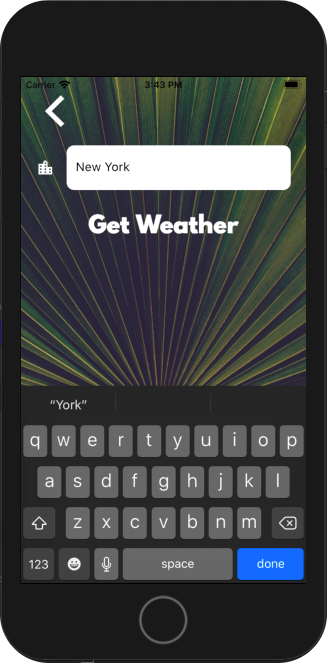
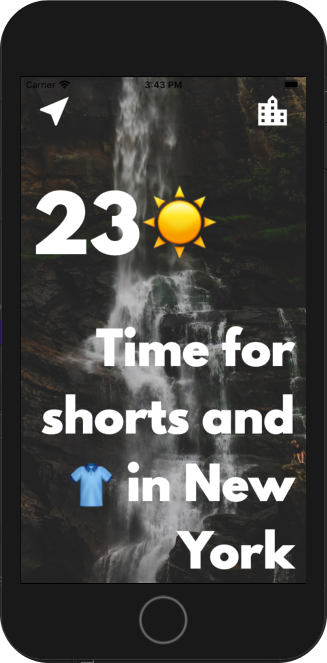
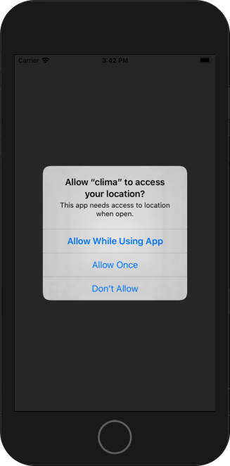

# Clima-Flutter educational weather app

A very basic educational weather app that fetches the current weather conditions in various locations by utilizing the OpenWeatherMap API.

## Screenshots

## To test and build

* Get an API key from OpenWeatherMap. (They send you an email verification notice and then you would have to wait for 2 hours).
* Edit lib/utilities/apikey_rename.dart to hold your API key.
* Rename apikey_rename.dart to apikey.dart
* Open an emulaton. On Mac 'open -a Simulator' for iOS simulator. Otherwise use Android Studio to run Android emulators. 
* Run 'flutter pub get' in a terminal from the main project folder. 
* Run 'flutter run' in the terminal. 
* To build (Android): Add your own android/key.propertis file using the keytool. 
* Modify app id to your own everywhere. 
* Run 'flutter build apk --no-shrink' in a terminal from the project root folder. 

### To modify the icon

You can edit docs/images/icon-clima-tailorvj.xcf in GIMP to modify the existing icon. 

The above icon is published under Creative Commons 4.0 and requires credit to Tailor VJ. 

### To generate your own app icon

* Replace assets/icon/icon.png with your own 432x432 icon image.
* Run 'flutter pub run flutter_launcher_icons:main' in the terminal.

## Uses

* Futures, async, await.
* OpenWeaterMap API.
* Mobild device location permissions and GPS.
* Dart http package for API utilization. 
* Geolocator package for device location. 
* Flutter launcer icons package for building all necessary distribution icons for iOS and Android. 
* Dart convert package to decode JSON data. 
* Flutter Navigator to route between screens and send data between them. 

### Packages used (in pubspec.yaml)

* geolocator: ^5.3.1
* http: ^0.12.1
* flutter_spinkit: ^4.1.2
* flutter_launcher_icons: ^0.7.5

## Credits

A weather app inspired by the beautiful designs made by [Olia Gozha](https://dribbble.com/shots/4663154-).

App icon is licensed under Creative Commons 4.0 and is a remix by Tailor VJ to 2 CC-licensed icons by:

*  "File:Rain (CoreUI Icons v1.0.0).svg" by CoreUI is licensed under CC BY 4.0
*  "File:OOjs UI icon sun-ltr.svg" by MGalloway (WMF) (WMF User Experience Design group) is licensed under CC BY-SA 4.0

This app was built during a Flutter course series by London App Brewery. 

## License GPL v3

[Copy of GPL v3 License](LICENSE.txt)

All rights reserved to Asaf Prihadash Tailor VJ